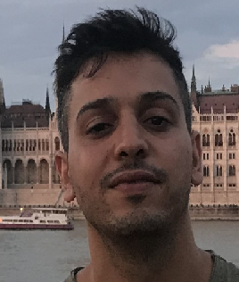

<head>

# Curriculum Vitae 

------------------------------------------------------------------------

   

**Mohamed Amine, AMOR**

|                                                           |                                  |     |
| :-------------------------------------------------------: | :------------------------------- | --- |
|   | <https://twitter.com/kaftejiman> |     |
|  | Hatay, Izmir, Turkey.            |     |
|  | kaftejiman protonmail .ch        |     |
|  | +90 0 - - - -                    |     |
|  | -.-.1991                         |     |
|  | Tunisian                         |     |

# Skills :

------------------------------------------------------------------------

-   **Languages:** *Arabic* (Mother tongue), *English* (Fluent),
    *French* (Fluent) , *Turkish* (Fluent).

-   **Programming**: Python, Java, Javascript, NodeJS, C, C\#.

-   **Visualization & Reporting :** Jupyter Notebook, LaTeX

-   **Hands on experience:** Reverse engineering, Native binary
    analysis, Exploit development, Mobile security

-   **Other:**

    -   Actif Capture The Flag competitions player with
        [the3000](https://ctftime.org/team/110885) (co-founder), overall
        rating place 31st worldwide.

    -   I document what I find blogging worthy journeys in my github.
        ([pwn](https://github.com/kaftejiman/pwn),
        [writeups](https://github.com/kaftejiman/ctf-writeups) and
        [gists](https://gist.github.com/kaftejiman))

------------------------------------------------------------------------

# Education Summary:  

-   

    **B.Eng Software Engineering** - Economy University of Izmir (Izmir
    Ekonomi), Izmir, Turkey.

    

-   

    **Math, Physics, Computer Sciences Preparatory** - National Institue
    of Applied Sciences and Technology, Tunis, Tunisia. (INSAT)

    

# Resume:

I am a Software Engineer and a Computer Security Researcher with a
strong educational background in Math and Electronics. I have been an
active CTF Player, my interests are in finding solutions to complex
challenges through advanced analytics. My skills-set covers reverse
engineering through carrying static and dynamic analysis and automated
binary analysis with increasing interest in mobile security and
simulating custom architectures. My aim is to simply increase my
understanding of systems and how they work.

# Work Experiences:

------------------------------------------------------------------------

<tr class="odd">
<td style="text-align: left;">
<strong>Computer Security Researcher, Independent</strong>

<ul>
    <li>
<strong>Independent Security Researcher:</strong>
</li>
    <ul>
        <li>
Joined <a href="https://app.intigriti.com/profile/kaftejiman">Intigriti bug bounty platform</a> as a security researcher with interest in mobile security.
</li>
        <li>
<strong>Technologies/Keywords:</strong> #bugbounty #research #mobile-security #native #binary-analysis #cve
</li>
    </ul>
    <li>
<strong>Jamal Fast and Efficient Mobile Analysis Framework.</strong>
</li>
    <ul>
        <li>
<a href="https://marketplace.visualstudio.com/items?itemName=kaftejiman.jamal">Jamal (Microsoft Visual Studio Marketplace)</a>.
</li>
        <li>
<strong>Technologies/Keywords:</strong> #binary-analysis #reverse-engineering #android #javascript #nodejs #java #gradle #graphviz #abstract-syntax-tree #soot #java-optimization
</li>
    </ul>
    <li>
<strong>Toy Programming Language that translates to Python for entry level learning compilers.</strong>
</li>
    <ul>
        <li>
<a href="https://github.com/kaftejiman/dawg">Dawg</a>.
</li>
        <li>
<strong>Technologies/Keywords:</strong> #programming-language #tutorial #fun #python #antlr #lex #yacc
</li>
    </ul>
</ul>
<tr class="odd">
<td style="text-align: left;">
<strong>Software Engineer, <a href="https://www.innovile.com/">Innovile Telecommunications, Izmir.</a></strong>

<ul>
<li>
Built driver tools for aiding in the automation of porting large sets of data to NoSQL.
</li>
<li>
<strong>Technologies/Keywords:</strong> #NoSQL #elasticsearch #oracle #odbc #C-sharp #.NET #Python #Makefile
</li>
</ul>
</td>
</tr>
<!-- Global site tag (gtag.js) - Google Analytics  -->

</td>
</tr>
